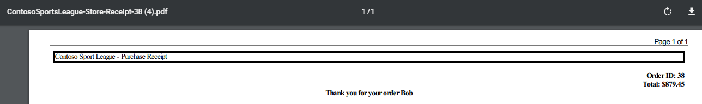
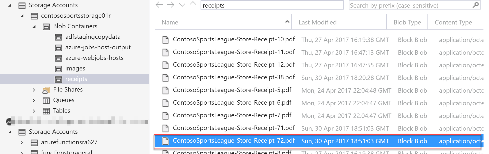
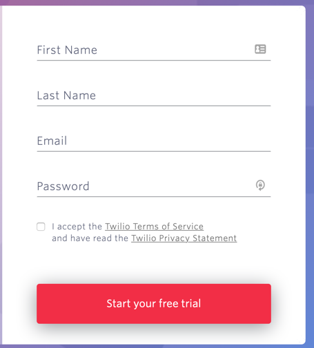
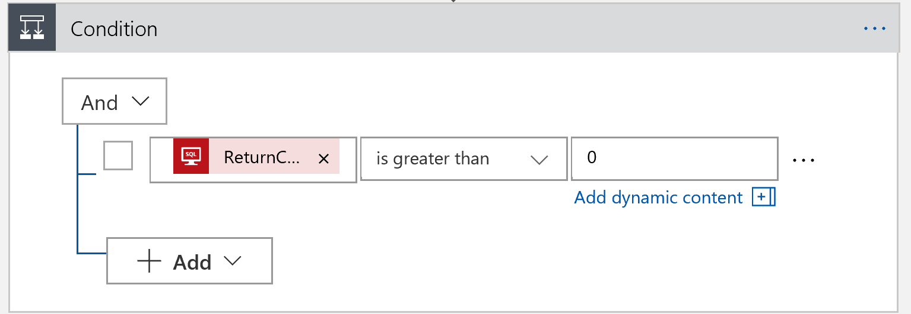
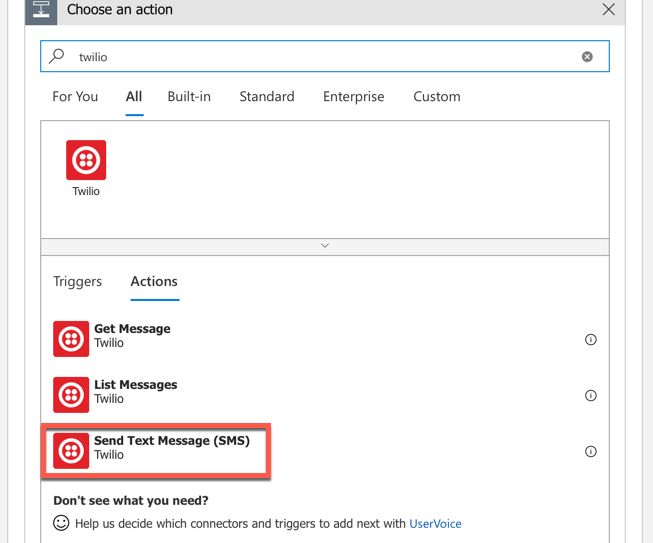

# Modern Cloud Apps

Before the hands-on lab setup guide

March 2020

## Table Of Contents
- [Modern cloud apps hands-on lab step-by-step](#modern-cloud-apps-hands-on-lab-step-by-step)
  - [Abstract and learning objectives](#abstract-and-learning-objectives)
  - [Overview](#overview)
  - [Solution architecture](#solution-architecture)
  - [Requirements](#requirements)
  - [Help references](#help-references)
  - [Exercise 5: Automating backend processes with Azure Functions and Logic Apps](#exercise-5-automating-backend-processes-with-azure-functions-and-logic-apps)
    - [Task 1: Create an Azure Function to Generate PDF Receipts](#task-1-create-an-azure-function-to-generate-pdf-receipts)
    - [Task 2: Create an Azure Logic App to Process Orders](#task-2-create-an-azure-logic-app-to-process-orders)
    - [Task 3: Use Twilio to send SMS Order Notifications](#task-3-use-twilio-to-send-sms-order-notifications)
      - [Subtask 1: Configure your Twilio trial account](#subtask-1-configure-your-twilio-trial-account)
      - [Subtask 2: Create a new logic app](#subtask-2-create-a-new-logic-app)

# Modern cloud apps hands-on lab step-by-step

## Abstract and learning objectives

In this hands-on lab, you will be challenged to implement an end-to-end scenario using a supplied sample that is based on Azure App Services, Microsoft Azure Functions, Azure SQL Database, Azure Logic Apps, and related services. The scenario will include implementing compute, storage, workflows, and monitoring, using various components of Microsoft Azure.

Please note that as opposed to the whiteboard design session, the lab is not focused on maintaining PCI compliance and using more advanced security features such as App Service Environment, Network Security Groups, and Application Gateway. The hands-on lab can be implemented on your own, but it is highly recommended to pair up with other members working on the lab to model a real-world experience and to allow each member to share their expertise for the overall solution.

By the end of this hands-on lab, you will have learned how to use several key services within Azure to improve overall functionality of the original solution, and to increase the security and scalability of the new and improved design.

## Overview

The Cloud Workshop: Modern Cloud Apps lab is a hands-on exercise that will challenge you to implement an end-to-end scenario using a supplied sample that is based on Microsoft Azure App Services and related services. The scenario will include implementing compute, storage, security, and scale using various components of Microsoft Azure. The lab can be implemented on your own, but it is highly recommended to pair up with additional team members to more closely model a real-world experience, and to allow members to share their expertise for the overall solution.

## Solution architecture


## Requirements

1. Microsoft Azure subscription
2. Local machine or a virtual machine configured with Visual Studio 2019 Community Edition
3. Twilio account and/or personal cell phone to setup a trial Twilio account

## Help references

| Description | Links |
|:---------|:-------------|
| SQL firewall | <https://azure.microsoft.com/en-us/documentation/articles/sql-database-configure-firewall-settings/> |
| Deploying a Web App | <https://azure.microsoft.com/en-us/documentation/articles/web-sites-deploy/> |
| Deploying an API app | <https://azure.microsoft.com/en-us/documentation/articles/app-service-dotnet-deploy-api-app/> |
| Accessing an API app from a JavaScript client | <https://azure.microsoft.com/en-us/documentation/articles/app-service-api-javascript-client/> |
| SQL Database Geo-Replication overview | <https://azure.microsoft.com/en-us/documentation/articles/sql-database-geo-replication-overview/> |
| What is Azure AD? | <https://azure.microsoft.com/en-us/documentation/articles/active-directory-whatis/> |
| Azure Web Apps authentication | <http://azure.microsoft.com/blog/2014/11/13/azure-websites-authentication-authorization/> |
| View your access and usage reports | <https://msdn.microsoft.com/en-us/library/azure/dn283934.aspx> |
| Custom branding an Azure AD Tenant | <https://msdn.microsoft.com/en-us/library/azure/Dn532270.aspx> |
| Service Principal Authentication | <https://docs.microsoft.com/en-us/azure/app-service-api/app-service-api-dotnet-service-principal-auth> |
| Consumer Site B2C | <https://docs.microsoft.com/en-us/azure/active-directory-b2c/active-directory-b2c-devquickstarts-web-dotnet> |
| Getting Started with Active Directory B2C | <https://azure.microsoft.com/en-us/trial/get-started-active-directory-b2c/> |
| How to Delete an Azure Active Directory | <https://blog.nicholasrogoff.com/2017/01/20/how-to-delete-an-azure-active-directory-add-tenant/> |
| Run performance tests on your app | <http://blogs.msdn.com/b/visualstudioalm/archive/2015/09/15/announcing-public-preview-for-performance-load-testing-of-azure-webapp.aspx> |
| Application Insights Custom Events | <https://azure.microsoft.com/en-us/documentation/articles/app-insights-api-custom-events-metrics/> |
| Enabling Application Insights | <https://azure.microsoft.com/en-us/documentation/articles/app-insights-start-monitoring-app-health-usage/> |
| Detect failures | <https://azure.microsoft.com/en-us/documentation/articles/app-insights-asp-net-exceptions/> |
| Monitor performance problems | <https://azure.microsoft.com/en-us/documentation/articles/app-insights-web-monitor-performance/> |
| Creating a Logic App | <https://azure.microsoft.com/en-us/documentation/articles/app-service-logic-create-a-logic-app/> |
| Logic app connectors | <https://azure.microsoft.com/en-us/documentation/articles/app-service-logic-connectors-list/> |
| Logic Apps Docs | <https://docs.microsoft.com/en-us/azure/logic-apps/logic-apps-what-are-logic-apps> |
| Azure Functions -- create first function | <https://docs.microsoft.com/en-us/azure/azure-functions/functions-create-first-azure-function> |
| Azure Functions docs | <https://docs.microsoft.com/en-us/azure/logic-apps/logic-apps-azure-functions> |

## Exercise 5: Automating backend processes with Azure Functions and Logic Apps

Contoso wants to automate the process of generating receipts in PDF format and alerting users when their orders have been processed using Azure Logic App and Functions. To run custom snippets of C\# or node.js in logic apps, you can create custom functions through Azure Functions. [Azure Functions](https://docs.microsoft.com/en-us/azure/azure-functions/functions-overview) offers server-free computing in Microsoft Azure and are useful for performing these tasks:

- Advanced formatting or compute of fields in logic apps

- Perform calculations in a workflow

- Extend the logic app functionality with functions that are supported in C\# or node.js

### Task 1: Create an Azure Function to Generate PDF Receipts

1. Select the **+Create a resource** button found on the upper left-hand corner of the Azure portal and then select **Compute \> Function App**. Select **Create** button at the bottom.

    

2. Provision and deploy the new function app, with the following settings:

    - [**Resource Group**](https://docs.microsoft.com/en-us/azure/azure-resource-manager/resource-group-overview): Use the existing resource group, **contososports**.

    - **Runtime Stack**: .NET Core.

    - **Region**: Choose the same region used for the e-commerce web apps in this lab.

3. Select **Next: Hosting >**.

4. On the **Hosting** tab, select the following values, then select **Review + create**:

    - **Operating System**: Windows.

    - **Plan type**: App service plan.

    - **Windows Plan**: Choose the App Service Plan used for the e-commerce web app.

5. Navigate to the Storage Account in the **contososports** resource group, go to **Access Keys** and copy the **Connection String** for the Storage Account. Paste your storage account connection string into Notepad to save for later.

    

6. Navigate to the **Function App** that was just created, and select **Configuration**.

    

7. Add a new Application Setting with the following values, then select **Save**:

    - **Name**: `contososportsstorage`.
    - **Value**: Enter the Connection String for your storage account.

    

8. To publish the Function App, open the Visual Studio solution, Right-click on the **ContosoFunctionApp** project, then select **Publish**.

    

9. On the **Pick a publish target** dialog, choose **Select existing**, then select **Create Profile**.

10. Select the **Function App**, then select **OK**.

    

11. Select **Publish**.

    The publish should only take minute or so. You can check the **Output** window for any errors that may occur.

    

12. To test your newly published Function App, start by navigating back to your Contoso Function App in the Azure Portal. Select the newly created **ContosoMakePDF** function listed in the functions.

13. select the **Test** link located on the right-hand blade.

    

14. Select **POST** for the HTTP method.

15. Open the **sample.dat** file found in your lab files Contoso.CreatePDFReport directory.  Copy the contents into the **Request body** text box.

    

16. Select the **Run** button located at the bottom of the blade.

    

    > **Note**: There is also a **Run** button located at the top of the Azure Function blade. Selecting either of these buttons will run the function just the same.

    After a few seconds, you should see logs like in the below image. You should see return status code of 200.  The **Output** text box should show recent Contoso purchase data. You should see a message stating the file has been created and stored in the blob storage.

    

16. Check your receipt PDF in the storage account blob.

    - Navigate to the ContosoSports storage account.
    - Select the **Blobs** link.

    

17. Choose the newly created **receipts** blob container.

    

18. Open **ContosoSportsLeague-Store-Receipt-XX.pdf** link.

    

    - Open the `...` link and choose download menu item.

    

### Task 2: Create an Azure Logic App to Process Orders

Without writing any code, you can automate business processes more easily and quickly when you create and run workflows with Azure Logic Apps. Logic Apps provide a way to simplify and implement scalable integrations and workflows in the cloud. It provides a visual designer to model and automate your process as a series of steps known as a workflow. There are [many connectors](https://docs.microsoft.com/en-us/azure/connectors/apis-list) across the cloud and on-premises to quickly integrate across services and protocols.

The advantages of using Logic Apps include the following:

- Saving time by designing complex processes using easy to understand design tools

- Implementing patterns and workflows seamlessly, that would otherwise be difficult to implement in code

- Getting started quickly from templates

- Customizing your logic app with your own custom APIs, code, and actions

- Connect and synchronize disparate systems across on-premises and the cloud

- Build off BizTalk server, API Management, Azure Functions, and Azure Service Bus with first-class integration support

1. Next, we will create a Logic App that will trigger when an item is added to the **receiptgenerator** queue. In the Azure Management Portal, select the **+Create a resource** button, search for **Logic App**, select the returned Logic App result, and select **Create**.

    

2. Fill out the name as **ContosoLogicApplication** along with your subscription, and use the existing resource group **contososports**. Choose the **same region** as your Web App and storage account. Select **Create**.

    

3. Open the logic app after it is deployed by choosing **All Services**, searching for and selecting **Logic App** and selecting the Logic App you just created.

    

4. select the **Logic App Designer** link.

    

5. In the Logic Apps Designer, under **Templates**, select **Blank Logic App**.

    

6. Search for **Azure Queues**.

    

7. Select **Azure Queues -- When there are messages in a queue**.

    

8. Specify **ContosoStorage** as the connection name, select the Contoso storage account from the list, and select **Create**.

    

9. Select the **receiptgenerator** queue from the drop-down, select **New Step**, and **Add an Action**.

    

10. Select **Azure Functions**.

    

11. Select the **Azure Function App** you just created.

    

12. Select the Azure function **ContosoMakePDF**.

    

13. Type this in the Request Body:

    ```json
    {"Order": pick MessageText from list on right }
    ```

    Make sure the syntax is json format. Sometimes the ":" will go to the right side of MessageText by mistake. Keep it on the left. It should look like this:

    

14. Select **Save** to save the Logic App.

15. There is one modification we need to make in the code. select the **CodeView** button.

    

16. Find the line of code in the body for the Order item that reads the MessageText value from the queue, and add the base64 function around it to ensure it encoded before passing it off to the Azure function. It should look like the following:

    ```json
    "Order": "@{base64(triggerBody()?['MessageText'])}"
    ```

    ![In the Order item code, the following line of code is circled: \"Order\": \"@{base64(triggerBody()?\[\'MessageText\'\])}\"](../Media/Screenshots/image251.png "Order item code")

17. Select **Save** again.

18. Run the logic app. It should process the orders you have submitted previously to test PDF generation. Using Azure Storage Explorer or Visual Studio Cloud Explorer you can navigate to the storage account and open the receipts container to see the created PDFs.

    

18. Double-click it to see the Purchase receipt.

19. Now, select the **Designer** button in the Logic Apps Designer screen. add two more steps to the flow for updating the database and removing the message from the queue after it has been processed. Switch back to the designer, select **+ New step**.

    

20. Select **SQL Server**.

    

21. Select **SQL Server - Update row**.

    

22. Name the connection `ContosoSportsDB`, and select the primary ContosoSportsDB database for your solution. Under the user name and password used to create it, select **Create**.

    

23. From the drop-down select the name of the table, **Orders**.

    

24. Press **Save** and ignore the error. Select the **Code View** button.

25. Replace these lines:

    

    With these:

    ```json
    "OrderDate": "@{body('ContosoMakePDF')['OrderDate']}",
    "FirstName": "@{body('ContosoMakePDF')['FirstName']}",
    "LastName": "@{body('ContosoMakePDF')['LastName']}",
    "Address": "@{body('ContosoMakePDF')['Address']}",
    "City": "@{body('ContosoMakePDF')['City']}",
    "State": "@{body('ContosoMakePDF')['State']}",
    "PostalCode": "@{body('ContosoMakePDF')['PostalCode']}",
    "Country": "@{body('ContosoMakePDF')['Country']}",
    "Phone": "@{body('ContosoMakePDF')['Phone']}",
    "SMSOptIn": "@{body('ContosoMakePDF')['SMSOptIn']}",
    "SMSStatus": "@{body('ContosoMakePDF')['SMSStatus']}",
    "Email": "@{body('ContosoMakePDF')['Email']}",
    "ReceiptUrl": "@{body('ContosoMakePDF')['ReceiptUrl']}",
    "Total": "@{body('ContosoMakePDF')['Total']}",
    "PaymentTransactionId": "@{body('ContosoMakePDF')['PaymentTransactionId']}",
    "HasBeenShipped": "@{body('ContosoMakePDF')['HasBeenShipped']}"
    ```

26. And modify the path variable to include the index key or OrderId to be as follows:

    ```json
    "path": "/datasets/default/tables/@{encodeURIComponent(encodeURIComponent('[dbo].[Orders]'))}/items/@{encodeURIComponent(encodeURIComponent(body('ContosoMakePDF')['OrderId']))}"
    ```

    The code should now look as follows for the update\_row method:

    

27. **Save** and return to the designer.

28. Your updated designer view should look like this:

    

29. Finally, let us add one more step to remove the message from the queue. Press **+New Step**. Type in Queue in the search box, and select Azure Queues -- Delete message.

    

30. Select the **receiptgenerator** queue from the list.

31. Select **Message Id** **\>** **Pop Receipt** from the list, and select **Save**.

    

32. Select Run on the Logic App Designer, and then run the Contoso sports Web App and check out an Item.

33. Run the call center website app, and select the last Details link in the list.
    

34. You should now see a Download receipt link because the database has been updated.

    

35. Select the Download receipt link to see the receipt.

36. Return to the Logic app and you should see all green check marks for each step. If not, select the yellow status icon to find out details.

    

### Task 3: Use Twilio to send SMS Order Notifications

#### Subtask 1: Configure your Twilio trial account

1. If you do not have a Twilio account, sign up for one for free at the following URL:

    [**https://www.twilio.com/try-twilio**](https://www.twilio.com/try-twilio)

    

2. Select **All Products & Services**.

    

3. Select **Phone Numbers**.

    

4. Select **Get Started**.

    

5. Select the **Get your first Twilio phone number** button.

    

6. Record the **Phone Number**, select the **Choose this Number** button on the **Your first Twilio Phone Number** prompt, and select **Done**.

    

7. Select **Home**, then **Settings**. Authenticate if needed and then record the **Account SID** and **Auth Token** for use when configuring the Twilio Connector.

    

#### Subtask 2: Create a new logic app

1. Open **SQL Server Management Studio** and connect to the SQL Database for the **ContosoSportsDB** database.

    >**Note**: You can find the database server name by:
    > - Navigate the Azure ContosoSportsDB in the portal.
    > - In the Overview, locate the **Show database connection strings** link.
    > - Copy the **Server** parameter value.
    e.g. Server=tcp:``contososqlserver2019th.database.windows.net,1433``

    

2. Under the **ContosoSportsDB** database, expand **Programmability**, right-click on **Stored Procedures**, select **New**, followed by **Stored Procedure...**

    

3. Replace the Stored Procedure Template code with the following:

    ```sql
    CREATE PROCEDURE [dbo].[GetUnprocessedOrders]
    AS
    declare @returnCode int 
    SELECT @returnCode = COUNT(*) FROM [dbo].[Orders] WHERE PaymentTransactionId is not null AND PaymentTransactionId <> '' AND Phone is not null AND Phone <> '' AND SMSOptIn = '1' AND SMSStatus is null
    return @returnCode

    GO
    ```

4. Select **Execute** in the toolbar, or press the F5 key.

    

5. Delete the SQL script for the Stored Procedure from the code editor, and replace it with the following:

    ```sql
    CREATE PROCEDURE [dbo].[ProcessOrders]
    AS
    SELECT * FROM [dbo].[Orders] WHERE PaymentTransactionId is not null AND PaymentTransactionId <> '' AND Phone is not null AND Phone <> '' AND SMSOptIn = '1' AND SMSStatus is null;

    UPDATE [dbo].[Orders] SET SMSStatus = 'sent' WHERE PaymentTransactionId is not null AND PaymentTransactionId <> '' AND Phone is not null AND Phone <> '' AND SMSOptIn = '1' AND SMSStatus is null;
    ```

6. Select **Execute** in the toolbar, or press the F5 key.

    

7. In the Azure Management Portal, select the **+Create a resource** button, then **Web**, and, finally **Logic App**.

    

8. On the **Create logic app** blade, assign a value for **Name**, and set the Resource Group to **contososports**.

    

9. In the navigation menu to the left in the Portal, select **Resource Groups** then **contososports**, then the new Logic App you just created. 

10. In the Logic App blade, under the **DEVELOPMENT TOOLS** menu area, select **Logic App Designer**. Then, select the **Blank Logic App** Template.

    

11. On the **Logic Apps Designer**, select **Schedule**. Then, select **Schedule - Recurrence**.

    

12. Set the **FREQUENCY** to **MINUTE**, and **INTERVAL** to 1.

    

13. Select the **New Step** button followed by **Add an action**.

    

14. Type **SQL Server** into the filter box, and select the SQL **Server -- Execute stored procedure** action.

    

15. The first time you add a SQL action, you will be prompted for the connection information. Name the connection **ContosoDB**, input the server and database details used earlier, and select **Create**.

    

16. Select the **\[dbo\].\[GetUnprocessedOrders\]** stored procedure from the drop-down on the Procedure Name field.

    ![In the Execute stored procedure section, the Procedure name is \[dbo\].\[GetUnprocessedOrders\].](../Media/Screenshots/image288.png "Execute stored procedure section")

17. Select **New Step**, and search for and select the **Control** object.

    

18. Select **New Step**, and search for and select the **Control -> Condition** object.

      

19. Select **Choose a value**, and then select **Return Code** from the Dynamic content tile.

    

20. Specify **ReturnCode**, set the RELATIONSHIP to **is greater than**, and set the VALUE to **0**.

    

21. Select the **Add an action** link on the **If true** condition.

    

22. Select **SQL Server**, and then select the **SQL Server -- Execute stored procedure** action

    

23. Select the **ProcessOrders** stored procedure in the Procedure name dropdown.

    ![Under If Yes, Execute stored procedure 2 is selected, and the Procedure name is \[dbo\].\[ProcessOrders\].](../Media/Screenshots/image293.png "If yes section")

24. Select the **Add an action** link.

    

25. Type **Twilio** in the filter box, and select the **Twilio -- Send Text Message (SMS)** connector.

    

26. Set the Connection Name to Twilio, specify your Twilio **Account SID** and **Authentication Token**, then select the **Create** button.

    ")

27. Using the drop-down, select your Twilio number for the **FROM PHONE NUMBER** field. Specify a place holder phone number in the **TO PHONE NUMBER**, and a **TEXT** message.

    ")

28. On the Logic App toolbar, select the **Code View** button.

    

29. Find the **Send\_Text\_Message\_(SMS)** action, and modify the body property of the Twilio action:

    

    Add the following code between Hello and the comma:

    ```json
    "@{item()['FirstName']}"
    ```

    

30. Modify the **to** property to pull the phone number from the item.

    ```json
    "to": "@{item()['Phone']}"
    ```

    

31. Immediately before the **Send\_Text\_Message\_(SMS)** section, create a new line, and add the following code:

  ```json
    "forEach_email": {
      "type": "Foreach",
      "foreach": "@body('Execute_stored_procedure_(V2)_2')['ResultSets']['Table1']",
      "actions": {
  ```

32. Remove the **runAfter** block from the **Send\_Text\_Message\_(SMS)** action.

    

33. Locate the closing bracket of the **Send\_Text\_Message\_(SMS)** action, create a new line after it (be **SURE** to place a leading comma after the closing bracket), and add the following code:

  ```json
        },
        "runAfter": {
            "Execute_stored_procedure_(V2)_2": [
                "Succeeded"
            ]
        }
    }
  ```

34. Select **Save** on the toolbar to enable the logic app.

    

35. After the code for the **Send\_Text\_Message\_(SMS)** has been modified to be contained within the **forEach\_email** action and you save it, it should look like the following:

    

36. Your workflow should look like below, and you should receive a text for each order you have placed.

    

