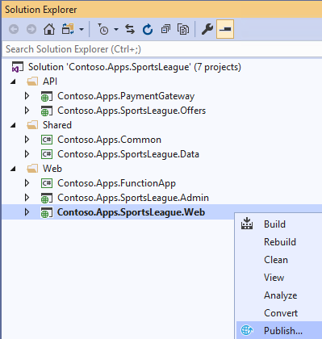
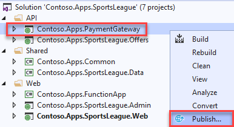
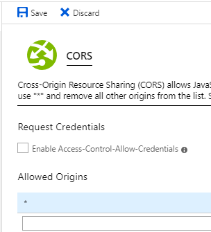

# Modern Cloud Apps

Before the hands-on lab setup guide

March 2020

## Table Of Contents
- [Modern cloud apps hands-on lab step-by-step](#modern-cloud-apps-hands-on-lab-step-by-step)
  - [Abstract and learning objectives](#abstract-and-learning-objectives)
  - [Overview](#overview)
  - [Solution architecture](#solution-architecture)
  - [Requirements](#requirements)
  - [Help references](#help-references)
  - [Exercise 1: Proof of concept deployment](#exercise-1-proof-of-concept-deployment)
    - [Task 1: Deploy the e-commerce website, SQL Database, and storage](#task-1-deploy-the-e-commerce-website-sql-database-and-storage)
      - [Subtask 1: Configure SQL Database Firewall and Retrieve Connection String](#subtask-1-configure-sql-database-firewall-and-retrieve-connection-string)
      - [Subtask 2: Retrieve Storage Account Access Keys](#subtask-2-Retrieve-Storage-Account-Access-Keys)
      - [Subtask 3: Update the configuration in the starter project](#subtask-3-update-the-configuration-in-the-starter-project)
      - [Subtask 4: Deploy the e-commerce Web App from Visual Studio](#subtask-4-deploy-the-e-commerce-web-app-from-visual-studio)
    - [Task 2: Setup SQL Database Geo-Replication](#task-2-setup-sql-database-geo-replication)
      - [Subtask 1: Add secondary database](#subtask-1-add-secondary-database)
      - [Subtask 2: Failover secondary SQL database](#subtask-2-failover-secondary-sql-database)
      - [Subtask 3: Test e-commerce Web App after Failover](#subtask-3-test-e-commerce-web-app-after-failover)
      - [Subtask 4: Revert Failover back to Primary database](#subtask-4-revert-failover-back-to-primary-database)
      - [Subtask 5: Test e-commerce Web App after reverting failover](#subtask-5-test-e-commerce-web-app-after-reverting-failover)
    - [Task 3: Deploying the Call Center admin website](#task-3-deploying-the-call-center-admin-website)
      - [Subtask 1: Provision the call center admin Web App](#subtask-1-provision-the-call-center-admin-web-app)
      - [Subtask 2: Update the configuration in the starter project](#subtask-2-update-the-configuration-in-the-starter-project)
      - [Subtask 3: Deploy the call center admin Web App from Visual Studio](#subtask-3-deploy-the-call-center-admin-web-app-from-visual-studio)
    - [Task 4: Deploying the payment gateway](#task-4-deploying-the-payment-gateway)
      - [Subtask 1: Provision the payment gateway API app](#subtask-1-provision-the-payment-gateway-api-app)
      - [Subtask 2: Deploy the Contoso.Apps.PaymentGateway project in Visual Studio](#subtask-2-deploy-the-contosoappspaymentgateway-project-in-visual-studio)
    - [Task 5: Deploying the Offers Web API](#task-5-deploying-the-offers-web-api)
      - [Subtask 1: Provision the Offers Web API app](#subtask-1-provision-the-offers-web-api-app)
      - [Subtask 2: Configure Cross-Origin Resource Sharing (CORS)](#subtask-2-configure-cross-origin-resource-sharing-cors)
      - [Subtask 3: Update the configuration in the starter project](#subtask-3-update-the-configuration-in-the-starter-project-1)
      - [Subtask 4: Deploy the Contoso.Apps.SportsLeague.Offers project in Visual Studio](#subtask-4-deploy-the-contosoappssportsleagueoffers-project-in-visual-studio)
    - [Task 6: Update and deploy the e-commerce website](#task-6-update-and-deploy-the-e-commerce-website)
      - [Subtask 1: Update the Application Settings for the Web App that hosts the Contoso.Apps.SportsLeague.Web project](#subtask-1-update-the-application-settings-for-the-web-app-that-hosts-the-contosoappssportsleagueweb-project)
      - [Subtask 2: Validate App Settings are correct](#subtask-2-validate-app-settings-are-correct)

# Modern cloud apps hands-on lab step-by-step

## Abstract and learning objectives

In this hands-on lab, you will be challenged to implement an end-to-end scenario using a supplied sample that is based on Azure App Services, Microsoft Azure Functions, Azure SQL Database, Azure Logic Apps, and related services. The scenario will include implementing compute, storage, workflows, and monitoring, using various components of Microsoft Azure.

Please note that as opposed to the whiteboard design session, the lab is not focused on maintaining PCI compliance and using more advanced security features such as App Service Environment, Network Security Groups, and Application Gateway. The hands-on lab can be implemented on your own, but it is highly recommended to pair up with other members working on the lab to model a real-world experience and to allow each member to share their expertise for the overall solution.

By the end of this hands-on lab, you will have learned how to use several key services within Azure to improve overall functionality of the original solution, and to increase the security and scalability of the new and improved design.

## Overview

The Cloud Workshop: Modern Cloud Apps lab is a hands-on exercise that will challenge you to implement an end-to-end scenario using a supplied sample that is based on Microsoft Azure App Services and related services. The scenario will include implementing compute, storage, security, and scale using various components of Microsoft Azure. The lab can be implemented on your own, but it is highly recommended to pair up with additional team members to more closely model a real-world experience, and to allow members to share their expertise for the overall solution.

## Solution architecture

## Requirements

1. Microsoft Azure subscription
2. Local machine or a virtual machine configured with Visual Studio 2019 Community Edition
3. Twilio account and/or personal cell phone to setup a trial Twilio account

## Help references

| Description | Links |
|:---------|:-------------|
| SQL firewall | <https://azure.microsoft.com/en-us/documentation/articles/sql-database-configure-firewall-settings/> |
| Deploying a Web App | <https://azure.microsoft.com/en-us/documentation/articles/web-sites-deploy/> |
| Deploying an API app | <https://azure.microsoft.com/en-us/documentation/articles/app-service-dotnet-deploy-api-app/> |
| Accessing an API app from a JavaScript client | <https://azure.microsoft.com/en-us/documentation/articles/app-service-api-javascript-client/> |
| SQL Database Geo-Replication overview | <https://azure.microsoft.com/en-us/documentation/articles/sql-database-geo-replication-overview/> |
| What is Azure AD? | <https://azure.microsoft.com/en-us/documentation/articles/active-directory-whatis/> |
| Azure Web Apps authentication | <http://azure.microsoft.com/blog/2014/11/13/azure-websites-authentication-authorization/> |
| View your access and usage reports | <https://msdn.microsoft.com/en-us/library/azure/dn283934.aspx> |
| Custom branding an Azure AD Tenant | <https://msdn.microsoft.com/en-us/library/azure/Dn532270.aspx> |
| Service Principal Authentication | <https://docs.microsoft.com/en-us/azure/app-service-api/app-service-api-dotnet-service-principal-auth> |
| Consumer Site B2C | <https://docs.microsoft.com/en-us/azure/active-directory-b2c/active-directory-b2c-devquickstarts-web-dotnet> |
| Getting Started with Active Directory B2C | <https://azure.microsoft.com/en-us/trial/get-started-active-directory-b2c/> |
| How to Delete an Azure Active Directory | <https://blog.nicholasrogoff.com/2017/01/20/how-to-delete-an-azure-active-directory-add-tenant/> |
| Run performance tests on your app | <http://blogs.msdn.com/b/visualstudioalm/archive/2015/09/15/announcing-public-preview-for-performance-load-testing-of-azure-webapp.aspx> |
| Application Insights Custom Events | <https://azure.microsoft.com/en-us/documentation/articles/app-insights-api-custom-events-metrics/> |
| Enabling Application Insights | <https://azure.microsoft.com/en-us/documentation/articles/app-insights-start-monitoring-app-health-usage/> |
| Detect failures | <https://azure.microsoft.com/en-us/documentation/articles/app-insights-asp-net-exceptions/> |
| Monitor performance problems | <https://azure.microsoft.com/en-us/documentation/articles/app-insights-web-monitor-performance/> |
| Creating a Logic App | <https://azure.microsoft.com/en-us/documentation/articles/app-service-logic-create-a-logic-app/> |
| Logic app connectors | <https://azure.microsoft.com/en-us/documentation/articles/app-service-logic-connectors-list/> |
| Logic Apps Docs | <https://docs.microsoft.com/en-us/azure/logic-apps/logic-apps-what-are-logic-apps> |
| Azure Functions -- create first function | <https://docs.microsoft.com/en-us/azure/azure-functions/functions-create-first-azure-function> |
| Azure Functions docs | <https://docs.microsoft.com/en-us/azure/logic-apps/logic-apps-azure-functions> |

## Exercise 1: Proof of concept deployment

Duration: 60 minutes

Contoso has asked you to create a proof of concept deployment in Microsoft Azure by deploying the web, database, and API applications for the solution as well as validating that the core functionality of the solution works. Ensure all resources use the same resource group previously created for the App Service Environment.

### Task 1: Deploy the e-commerce website, SQL Database, and storage

In this exercise, you will provision a website via the Azure **Web App + SQL** template using the Microsoft Azure Portal. You will then edit the necessary configuration files in the starter project and deploy the e-commerce website.

#### Subtask 1: Configure SQL Database Firewall and Retrieve Connection String

1. Navigate to the Azure Management portal, [http://portal.azure.com](http://portal.azure.com/), using a new tab or instance and login with your lab-provided Azure credentials.

2. Navigate to the **contososports** resource group.

3. Select the **ContosoSportsDB** SQL Database.

    

4. On the **SQL Database** blade, select the **Show database connection strings** link.

    

5. On the **Database connection strings** blade, select and copy the **ADO.NET** connection string. Then, save it in **Notepad** for use later, being sure to replace the placeholders with your username and password with **demouser** and **demo@pass123**, respectively.

    

6. Go back to the **contososports** resource group blade, and select the **contososports** SQL Server.

    

7. On the **Overview** screen of the **SQL Server** blade, select **Set server firewall** link at the top.

    

8. On the **Firewall Settings** blade, specify a new rule named **ALL**, with START IP **0.0.0.0**, and END IP **255.255.255.255**.

    

    >**Note**: This is only done to make the lab easier to do. In production, you do **NOT** want to open your SQL Database to all IP Addresses this way. Instead, you will want to specify just the IP Addresses you wish to allow through the Firewall.

9. Select **Save**.

    

10. Update progress can be found by selecting the **Notifications** link located at the top of the page.

    

11. Close all configuration blades.

#### Subtask 2: Retrieve Storage Account Access Keys

1. Go back to the **contososports** blade resource group, and select the **contoso** Storage account.

2. On the **Storage account** blade, scroll down, and, under the **SETTINGS** menu area, select the **Access keys** option.

    

3. On the **Access keys** blade, select the copy button by the **Connection String** field in the **key1** section. Paste the value into **Notepad** for later usage. 

    

#### Subtask 3: Update the configuration in the starter project

1. Go back to the **contososports** resource group blade.

2. Select the **contosoapp** web app (**App Service** type).

    

3. Copy the web app URL to Notepad.

    - select the **Overview** link.
    - Copy the URL to Notepad for later use. Use the **Copy to clipboard** link.

    

4. On the **App Service** blade, scroll down in the left pane. Under the **Settings** menu, select **Configuration**.

    

5. Add a new **Application setting** with the following values:

   - Key: `AzureQueueConnectionString`

   - Value: Enter the Connection String for the **Azure Storage Account** just created.

    

6. Locate **Connection Strings** section below **Application Settings**.

    

7. Add a new **Connection String** with the following values:

   - Name: `ContosoSportsLeague`

   - Value: **Enter the Connection String for the SQL Database just created**.

   - Type: `SQLAzure`

    >**Important**: Ensure you replace the string placeholder values **{your\_username}** **{your\_password\_here}** with the username and password you setup during previously.

    

8. Select **Save**.

#### Subtask 4: Deploy the e-commerce Web App from Visual Studio

1. Navigate to the **Contoso.Apps.SportsLeague.Web** project located in the **Web** folder using the **Solution Explorer** of Visual Studio.

    

2. Right-click the **Contoso.Apps.SportsLeague.Web** project, and select **Publish**.

    >**Note**: Don't publish if the configuration does not show your settings. Choose **New Profile** to publish to your Azure subscription.
    > 
    > 

3. Choose **Azure App Service** as the publish target, and choose **Select Existing** and then **Create Profile** at the bottom of the wizard.

    

4. If prompted, log on with your Azure Subscription credentials.

    

    >**Note**: If you Sign In and nothing happens, shut down Visual Studio reopen to the solution. Repeat the publishing steps.

5. Select the **Contoso Sports Web App** (with the name you created previously).

    

6. Select **OK**.

7. Select **Publish** to publish the Web application.

    >**Note**: If prompted with a warning about App Service supporting .NET Core 3.0.0, select **OK** to dismiss the warning.
    >
    > 

8. In the Visual Studio **Output** view, you will see a status that indicates the Web App was published successfully.

    

    >**Note**: Your URL will differ from the one shown in the Output screenshot because it must be globally unique.

9. A new browser should automatically open the new web applications. Validate the website by choosing the **Store** link on the menu. You should see product items. If products are returned, then the connection to the database is successful.

    

    >**Troubleshooting**: If the web site fails to show products, go back and double check all your connection string entries and passwords web application settings.

### Task 2: Setup SQL Database Geo-Replication

In this exercise, the attendee will provision a secondary SQL Database and configure Geo-Replication using the Microsoft Azure Portal.

#### Subtask 1: Add secondary database

1. Using a new tab or instance of your browser, navigate to the Azure Management Portal <http://portal.azure.com>.

2. Select **SQL databases** in the navigation menu to the left, and select the name of the SQL Database you created previously.

    

3. Under the **SETTINGS** menu area, select **Geo-Replication**.

    

4. Select the Azure Region to place the Secondary within.

    

    The Secondary Azure Region should be the Region Pair for the region the SQL Database is hosted in. Consult <https://docs.microsoft.com/en-us/azure/best-practices-availability-paired-regions> to see which region pair the location you are using for this lab is in.

    >**Note**: If you choose a region that cannot be used as a secondary region, you will not be able to pick a pricing plan. Choose another region.

    

5. On the **Create secondary** blade, select **Secondary Type** as **Readable**.

6. Select **Target server** ***Configure required settings***.

    

7. On the **New server** blade, specify the following configuration:

   - Server name: **A unique value (ensure the green checkmark appears)**

   - Server admin login: **demouser**

   - Password and Confirm Password: **demo@pass123**

    

8. Once the values are accepted in the **New server** blade, choose **Select**.

    

9. On the **Create secondary** blade, select **OK**.

    

    > **Note**: The Geo-Replication will take a few minutes to complete.

10. After the Geo-Replication has finished provisioning, select **SQL Databases** in the navigation menu to the left.

    

11. Select the name of the Secondary SQL Database you just created.

    

12. On the **SQL Database** blade, open the **Show database connection strings** link.

    

13. On the **Database connection strings** blade, select and copy the **ADO.NET** connection string, and save it in Notepad for use later.

    

14. On the SQL database blade in the Essentials section, select the SQL Database Server name link.

    

15. On the **SQL Server** blade, select **Set server firewall** at the top.

    

16. On the **Firewall Settings** blade, specify a new rule named **ALL**, with START IP **0.0.0.0**, and END IP **255.255.255.255**.

    

17. Select **Save**.

    

18. Update progress can be found by choosing the **Notifications** link located at the top of the page.

    

19. Close all configuration blades.

#### Subtask 2: Failover secondary SQL database

>**Note**: This subtask is optional.

Since the Replication and Failover process can take anywhere from 10 to 30 minutes to complete, you have the choice to skip Subtask 2 through 5, and go directly to Task 3. However, if you have the time, it is recommended that you complete these steps.

1. Using a new tab or instance of your browser, navigate to the Azure Management Portal <http://portal.azure.com>.

2. In the navigation menu to the left, select **SQL databases**, and select the name of the *primary* SQL Database you created previously.

    

3. On the **Settings** blade, select **Geo-Replication**.

    

4. On the **Geo-Replication** blade, select the *secondary* database.

    

5. Select the **Forced Failover** button.

    

6. On the **Forced Failover** prompt, select **Yes**.

    

The failover may take a few minutes to complete. You can continue with the next Subtask modifying the Web App to point to the Secondary SQL Database while the Failover is pending.

#### Subtask 3: Test e-commerce Web App after Failover

1. Once completed, in the Azure Portal, select **SQL databases**, and select the NEW **ContosoSportsDB** secondary.

    

2. Next, select **Show database connection strings**, and copy it off thereby replacing the user and password.

    

3. From the Azure portal, select **Resource Groups**, and select **contososports**.

4. Select the **Web App** created earlier.

5. On the **App Service** blade, scroll down in the left pane, and select **Configuration settings**.

    

6. Scroll down, and locate the **Connection strings** section.

7. Update the **ContosoSportsLeague** Connection String to the value of the **original Secondary Azure SQL Database**.

    

    >**Note**: Ensure you replace the string placeholder values **{your\_username}** and **{your\_password\_here}** with the username and password you respectively setup during creation (demouser & demo@pass123).

    

8. Select the **Save** button.

9. On the **App Service** blade, select **Overview**.

    

10. On the **Overview** pane, select the **URL** for the Web App to open it in a new browser tab.

    

11. After the e-commerce Web App loads in Internet Explorer, select **STORE** in the top navigation bar of the website.

    

12. Verify the product list from the database displays.

    

#### Subtask 4: Revert Failover back to Primary database

1. Using a new tab or instance of your browser, navigate to the Azure Management Portal <http://portal.azure.com>.

2. In the new **SQL databases**, and select the name of the SQL Database you created previously.

    

3. On the **Settings** blade, select **Geo-Replication**.

    

4. On the **Geo-Replication** blade, select the Secondary database.

    

5. Select the **Forced Failover** button.

    

6. On the **Forced Failover** prompt, select **Yes**.

    

The failover may take a few minutes to complete. You can continue with the next Subtask modifying the Web App to point back to the Primary SQL Database while the Failover is pending.

#### Subtask 5: Test e-commerce Web App after reverting failover

1. In the Azure Portal, select **Resource Groups** **\>** **contososports** resource group.

2. Select the **Web App** created in a previous step.

3. On the **App Service** blade, scroll down in the left pane, and select **Configuration settings**.

    

4. Scroll down, and locate the **Connection strings** section.

5. Update the **ContosoSportsLeague** Connection String back to the value of the Connection String for the **original Primary SQL Database**.

    

    > **Note**: Ensure you replace the string placeholder values **{your\_username}** **{your\_password\_here}** with the username and password you respectively setup during creation (demouser & demo@pass123).

    

6. Select **Save**.

    

7. On the **App Service** blade, select **Overview**.

    

8. On the **Overview** pane, select the **URL** for the Web App to open it in a new browser tab.

    

9. After the e-commerce Web App loads in Internet Explorer, select **STORE** in the top navigation bar of the website.

    

10. Verify the product list from the database displays.

    

### Task 3: Deploying the Call Center admin website

In this exercise, you will provision a website via the Azure Web App template using the Microsoft Azure Portal. You will then edit the necessary configuration files in the Starter Project and deploy the call center admin website.

#### Subtask 1: Provision the call center admin Web App

1. Using a new tab or instance of your browser, navigate to the Azure Management portal <http://portal.azure.com>.

2. Select **+Create a resource** then select **Web**, then **Web App**.

3. Specify a **unique URL** for the Web App, and ensure the **same App Service Plan** and **resource group** you have used throughout the lab are selected. Also, specify **.NET Core 3.0** as the **Runtime stack**.

    

4. Select **Windows Plan**, and select the **ContosoSportsPlan** used by the front-end Web app.

5. After the values are accepted, select **Review and create**, then **Create**.  It will take a few minutes to provision.

#### Subtask 2: Update the configuration in the starter project

1. Navigate to the **App Service** blade for the Call Center Admin App just provisioned.

    

2. On the **App Service** blade, select **Configuration** in the left pane.

    

3. Scroll down, and locate the **Connection strings** section.

4. Add a new **Connection string** with the following values:

    - Name: `ContosoSportsLeague`

    - Value: **Enter the Connection String for the primary SQL Database**.

    - Type: `SQL Azure`

    

    >**Note**: Ensure you replace the string placeholder values **{your\_username}** **{your\_password\_here}** with the username and password you respectively setup during creation (demouser & demo@pass123).

    

    - Select the **Update** button.

5. Select the **Save** button.

    

#### Subtask 3: Deploy the call center admin Web App from Visual Studio

1. Navigate to the **Contoso.Apps.SportsLeague.Admin** project located in the **Web** folder using the **Solution Explorer** in Visual Studio.

2. Right-click the **Contoso.Apps.SportsLeague.Admin** project, and select **Publish**.

    

3. Choose **App Service** as the publish target, choose **Select Existing**, then select **Create Profile**

    

4. Select the **Web App** for the Call Center Admin App.

    

5. Select **OK**.

6. Select **Publish**.

    

6. Once deployment is complete, navigate to the Web App. It should look like the following:

    

### Task 4: Deploying the payment gateway

In this exercise, the attendee will provision an Azure API app template using the Microsoft Azure Portal. The attendee will then deploy the payment gateway API to the API app.

#### Subtask 1: Provision the payment gateway API app

1. Using a new tab or instance of your browser, navigate to the Azure Management Portal <http://portal.azure.com>.

2. Select **+Create a resource**, type **API App** into the marketplace search box, and press **Enter**.  Select the **Create** button.

    

3. On the new **API App** blade, create the following values:

   - **App name:** Specify a unique name for the App Name.
   - **Subscription:** Your Azure MSDN subscription.
   - **Resource Group:** select **Use existing** option.
   - **App Service Plan/Location** Select the same primary region used in previous steps.
   - **Application Insights:** **Disabled**

    

4. After the values are accepted, select **Create**.  It will take a few minutes to provision.

#### Subtask 2: Deploy the Contoso.Apps.PaymentGateway project in Visual Studio

1. Navigate to the **Contoso.Apps.PaymentGateway** project located in the **APIs** folder using the **Solution Explorer** in Visual Studio.

2. Right-click the **Contoso.Apps.PaymentGateway** project, and select **Publish**.

    

3. On the **Publish Web** dialog box, select **Azure App Service**, then choose **Select Existing**, and **Create Profile**.

    > **Note**: If your Azure resource group does not show, choose **New Profile**.

4. Select the Payment Gateway API app created earlier, select **OK**.

    

5. Select **Publish**.

6. In the Visual Studio **Output** view, you will see a status indicating the Web App was published successfully.

    

7. Copy and paste the gateway **URL** of the deployed **API App** into Notepad for later use.

8. Viewing the Web App in a browser will display the Swagger UI for the API.

   

### Task 5: Deploying the Offers Web API

In this exercise, the attendee will provision an Azure API app template using the Microsoft Azure Portal. The attendee will then deploy the Offers Web API.

#### Subtask 1: Provision the Offers Web API app

1. Using a new tab or instance of your browser, navigate to the Azure Management Portal (<http://portal.azure.com>).

2. Select **+Create a resource**, type **API App** into the marketplace search box, and press **Enter**.  Select the **Create** button.

3. On the new **API App** blade, specify a unique name for the **API App**, and ensure the previously used Resource Group and App Service Plan are selected.

    

4. After the values are accepted, select the **Create** button.

5. When the Web App template has completed provisioning, open the new API App by, in the navigation menu to the left, select **App Services** and then the Offer API app you just created.

   

#### Subtask 2: Configure Cross-Origin Resource Sharing (CORS)

1. On the **App Service** blade for the Offers API, under the **API** menu section, scroll down and select **CORS**.

    

2. In the **Allowed Origins** text box, specify `*` to allow all origins, and select **Save**.

    >**Note**: You should not normally do this in a production environment. In production, you should enter the specific domains as allowed origins you need to allow CORS access to the API. The wildcard (*) is used for this lab to make it easier just for this lab.

    

#### Subtask 3: Update the configuration in the starter project

1. On the **App Service** blade for the Offers API, select **Configuration**.

    

2. In the **Connection Strings** section, add a new **Connection string** with the following values:

      - Name: `ContosoSportsLeague`

      - Value: **Enter the Connection String for the SQL Database that was created**.

      - Type: `SQL Azure`

        

        >**Note**: Ensure you replace the string placeholder values **{your\_username}** **{your\_password\_here}** with the username and password you respectively setup during creation (demouser & demo@pass123).

        

      - Select the **Update** button.

3. Select the **Save** button.

    

#### Subtask 4: Deploy the Contoso.Apps.SportsLeague.Offers project in Visual Studio

1. Navigate to the **Contoso.Apps.SportsLeague.Offers** project located in the **APIs** folder using the **Solution Explorer** in Visual Studio.

2. Right-click the **Contoso.Apps.SportsLeague.Offers** project, and select **Publish**.

    

3. On the **Publish Web** dialog box, select **Azure App Service**, choose **Select Existing**, and select **Create Profile**.

    

4. Select the Offers API app created earlier, and select **OK**.

    

5. Select **Publish**.

6. In the Visual Studio **Output** view, you will see a status the API app was published successfully.

7. Record the value of the deployed API app URL into Notepad for later use.

8. Viewing the Web App in a browser will display the Swagger UI for the API.

    

### Task 6: Update and deploy the e-commerce website

#### Subtask 1: Update the Application Settings for the Web App that hosts the Contoso.Apps.SportsLeague.Web project

1. Using a new tab or instance of your browser, navigate to the Azure Management Portal <http://portal.azure.com>.

2. Select **Resource groups** then the **contososports** resource group.

3. Select the **App Service Web App** for the front-end web application.

    

4. On the **App Service** blade, scroll down, and select **Configuration** in the left pane.

    

5. Scroll down, and locate the **Applications settings** section.

    

6. Add a new **Application Setting** with the following values:

   - App Setting Name: `paymentsAPIUrl`

   - Value: Enter the **HTTPS** URL for the Payments API App with `/api/nvp` appended to the end.

        >**Example**: `https://paymentsapi0.azurewebsites.net/api/nvp`

    

7. Add another **Application Setting** with the following values:

   - App Setting Name: `offersAPIUrl`

   - Value: Enter the **HTTPS** URL for the Offers API App with `/api/get` appended to the end.

    >**Example**: `https://offersapi4.azurewebsites.net/api/get`

    

    >**Note**: Ensure both API URLs are using **SSL** (https://), or you will see a CORS errors.

8. Select **Save**.

#### Subtask 2: Validate App Settings are correct

1. On the **App Service** blade, select **Overview**.

    

2. In the **Overview** pane, select the **URL** for the Web App to open it in a new browser tab.

    

3. On the homepage, you should see the latest offers populated from the Offers API.

    

4. Submit several test orders to ensure all pieces of the site are functional.  **Accept the default data during the payment processing.**

    

>**Leader Note**: If the attendee is still experiencing CORS errors, ensure the URLs to the Web App in Azure local host are exact.

