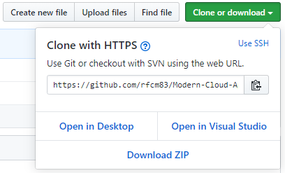
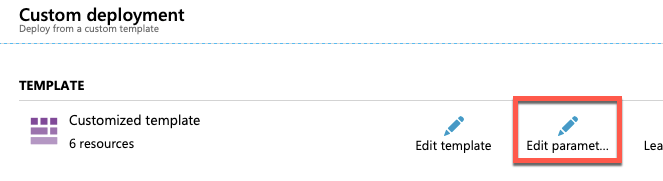
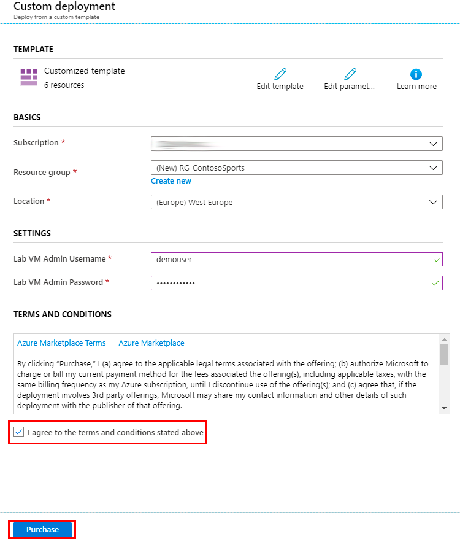
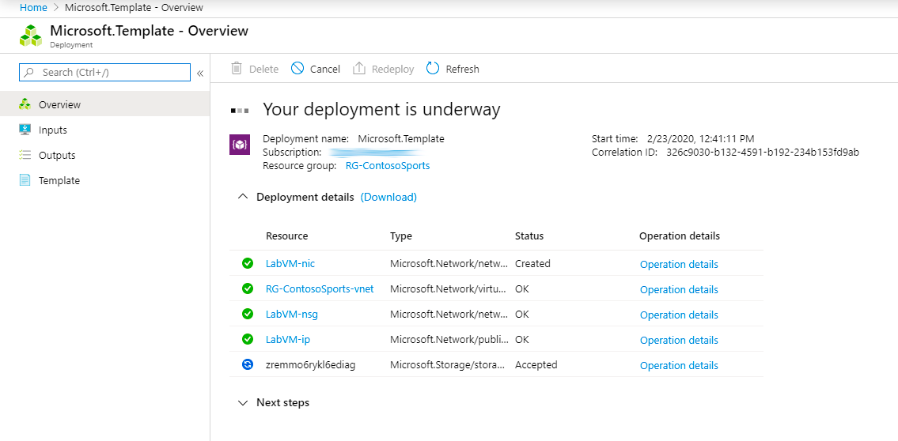
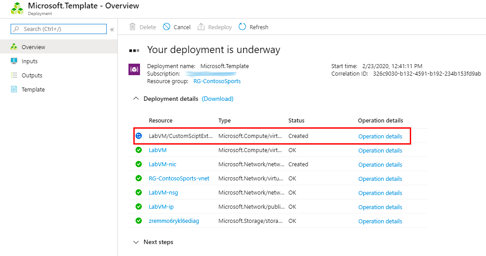
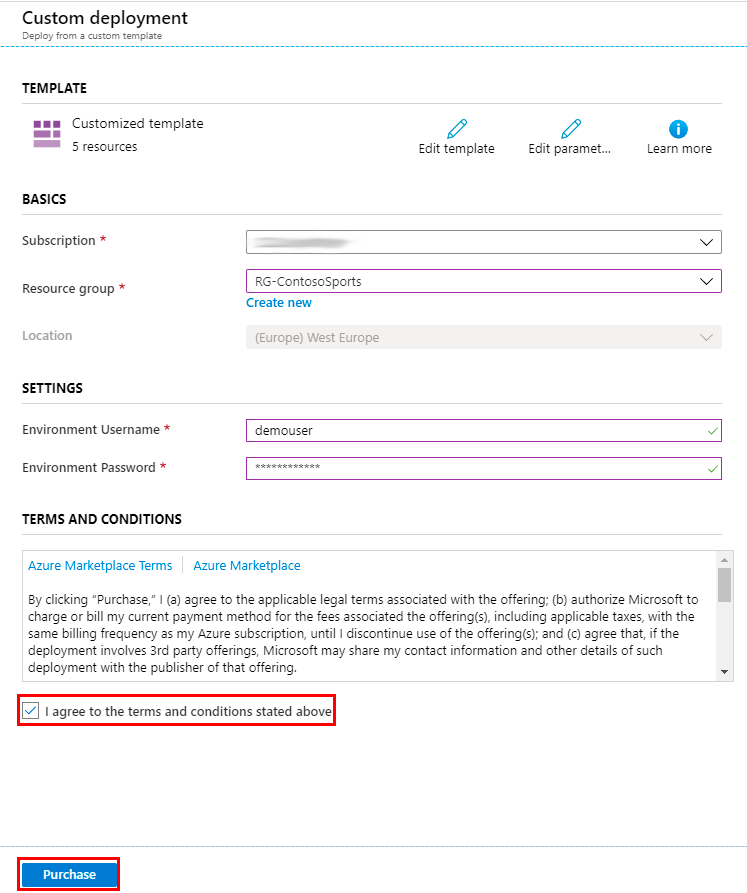

# Modern Cloud Apps

Before the hands-on lab setup guide

March 2020

## Table Of Contents

- [Modern cloud apps before the hands-on lab setup guide](#Modern-cloud-apps-before-the-hands-on-lab-setup-guide)
  - [Requirements](#Requirements)
  - [Before the hands-on lab](#Before-the-hands-on-lab)
    - [Task 1: Download GitHub resources](#Task-1-Download-GitHub-resources)
    - [Task 2: Deploy Lab VM Resources to Azure](#Task-2-Deploy-Lab-VM-Resources-to-Azure)
    - [Task 3: Deploy Environment Resources to Azure](#Task-3-Deploy-Environment-Resources-to-Azure)
    - [Task 4: Explore the Contoso Sports League sample](#Task-4-Explore-the-Contoso-Sports-League-sample)

# Modern cloud apps before the hands-on lab setup guide

## Requirements

- Microsoft Azure MSDN subscription

  - You will need permissions within the Azure Subscription and Azure Active Directory (Azure AD) to create users and setup Azure AD B2C.

- Local machine or Azure virtual machine configured with:

  - Visual Studio 2019 Community Edition or later
  - Windows Server 2016

## Before the hands-on lab

Duration: 30 minutes

Before initiating the hands-on lab, you will setup an environment to use for the rest of the exercises.

### Task 1: Download GitHub resources

1. Open a browser window to the Cloud Workshop GitHub repository (<https://github.com/rfcm83/Modern-Cloud-Apps>).

2. Select **Clone or download**, then select **Download Zip**.

    

3. Extract the zip file to your local machine, be sure to keep note of where you have extracted the files. You should now see a set of folders

### Task 2: Deploy Lab VM Resources to Azure

1. Select the following **Deploy to Azure** button to deploy the ARM Template with the Lab VM resources for this lab. This link will deep link into the Azure Portal, passing in the ARM Template for deploying the resources for this lab.

    

    >**Note**: If you have issues with the **Deploy to Azure** link, then do a new **Custom deployment** in the Azure Portal using the `/Hands-on lab/scripts/labvm/template.json` ARM Template within the lab files.

2. On the **Custom deployment** blade, select **Create new** for the **Resource group** field, and enter `ContosoSports-[your initials or first name]`.

3. Select **Edit parameters**.

    

4. On the **Edit parameters** pane, select the **Load file** button.

5. Locate and open the `\Hands-on lab\Scripts\labvm\parameters.json` file within the extracted files.

6. Select **Save**.

7. Check the **I agree to the terms and conditions stated above** checkbox.

8. Select **Purchase**.

    

9. The deployment will take 15-30 minutes to complete. Continue to the next Task while this is deploying.

    To view the progress, select the **Deployments** link, then select the **Microsoft.Template** deployment.

    

    > **Note**: A configuration script to install SSMS and the requires lab files will run after the deployment of the LabVM completes. The task will be listed on the deployment progress screen as `LabVM/CustomScriptExtension`. You should wait for this task to complete before attempting to log into the LabVM in the next task, as it downloads and installs files you will need.
    >
    > 

### Task 3: Deploy Environment Resources to Azure

1. Select the following **Deploy to Azure** button to deploy the ARM Template with the Environment resources for this lab. This link will deep link into the Azure Portal, passing in the ARM Template for deploying the resources for this lab.

    

    >**Note**: If you have issues with the **Deploy to Azure** link, then do a new **Custom deployment** in the Azure Portal using the `/Hands-on lab/scripts/environment/template.json` ARM Template within the lab files.

2. On the **Custom deployment** blade, select **Create new** for the **Resource group** field, and enter `contososports[your initials or first name]`.

3. Select **Edit parameters**.

    

4. On the **Edit parameters** pane, select the **Load file** button.

5. Locate and open the `\Hands-on lab\Scripts\environment\parameters.json` file within the extracted files.

6. Select **Save**.

7. On the **Location** field for the Custom deployment, choose the Azure Region closest to you.

    > **Note**: For this lab, it is recommended you use the **East US**, **North Europe**, or **Australia East** Azure Region. There are certain Azure regions that don't support all the resources provisioned by the ARM Template. This limitation can also vary depending on restrictions applied to the type of Azure Subscription you are using.

7. Check the **I agree to the terms and conditions stated above** checkbox.

8. Select **Purchase**.

    

9. The deployment will take 5 - 10 minutes to complete.

### Task 4: Explore the Contoso Sports League sample

1. Connect to the **LabVM** that was deployed using the previous template using Remote Desktop, using these credentials:

    - **Admin username**: `.\demouser`
    - **Admin password**: `demo@pass123`

    > **Note**: Be sure to wait until the **Lab VM** ARM Template deployment has completed before connecting to the **LabVM** virtual machine.

2. Open the `C:\MCW` folder.

3. From the **Contoso Sports League** folder under **MCW**, open the Visual Studio Solution file: `Contoso.Apps.SportsLeague.sln`.

4. The solution contains the following projects:

    | Project | Description |
    |:----------|:-------------|
    | Contoso.Apps.SportsLeague.Web |   Contoso Sports League e-commerce application |
    | Contoso.Apps.SportsLeague.Admin |   Contoso Sports League call center admin application |
    | Contoso.Apps.Common  |   Shared tier |
    | Contoso.Apps.SportsLeague.Data  |   Shared tier |
    | Contoso.Apps.FunctionApp  |   Function app tier |
    | Contoso.Apps.SportsLeague.Offers |  API for returning list of available products |
    | Contoso.Apps.PaymentGateway   |     API for payment processing |

You should follow all the steps provided *before* performing the Hands-on lab.

