# Modern Cloud Apps

Before the hands-on lab setup guide

March 2020

## Table Of Contents
- [Modern cloud apps hands-on lab step-by-step](#modern-cloud-apps-hands-on-lab-step-by-step)
  - [Abstract and learning objectives](#abstract-and-learning-objectives)
  - [Overview](#overview)
  - [Solution architecture](#solution-architecture)
  - [Requirements](#requirements)
  - [Help references](#help-references)
  - [Exercise 4: Enabling Telemetry with Application Insights](#exercise-4-enabling-telemetry-with-application-insights)
    - [Task 1: Configure the application for telemetry](#task-1-configure-the-application-for-telemetry)
      - [Subtask 1: Add Application Insights Telemetry to the e-commerce website project](#subtask-1-add-application-insights-telemetry-to-the-e-commerce-website-project)
      - [Subtask 2: Enable client side telemetry](#subtask-2-enable-client-side-telemetry)
      - [Subtask 3: Deploy the e-commerce Web App from Visual Studio](#subtask-3-deploy-the-e-commerce-web-app-from-visual-studio)
    - [Task 2: Creating the web performance test and load test](#task-2-creating-the-web-performance-test-and-load-test)
      - [Subtask 1: Create the load test](#subtask-1-create-the-load-test)
      - [Subtask 2: View the Application Insights logs](#subtask-2-view-the-application-insights-logs)

# Modern cloud apps hands-on lab step-by-step

## Abstract and learning objectives

In this hands-on lab, you will be challenged to implement an end-to-end scenario using a supplied sample that is based on Azure App Services, Microsoft Azure Functions, Azure SQL Database, Azure Logic Apps, and related services. The scenario will include implementing compute, storage, workflows, and monitoring, using various components of Microsoft Azure.

Please note that as opposed to the whiteboard design session, the lab is not focused on maintaining PCI compliance and using more advanced security features such as App Service Environment, Network Security Groups, and Application Gateway. The hands-on lab can be implemented on your own, but it is highly recommended to pair up with other members working on the lab to model a real-world experience and to allow each member to share their expertise for the overall solution.

By the end of this hands-on lab, you will have learned how to use several key services within Azure to improve overall functionality of the original solution, and to increase the security and scalability of the new and improved design.

## Overview

The Cloud Workshop: Modern Cloud Apps lab is a hands-on exercise that will challenge you to implement an end-to-end scenario using a supplied sample that is based on Microsoft Azure App Services and related services. The scenario will include implementing compute, storage, security, and scale using various components of Microsoft Azure. The lab can be implemented on your own, but it is highly recommended to pair up with additional team members to more closely model a real-world experience, and to allow members to share their expertise for the overall solution.

## Solution architecture


## Requirements

1. Microsoft Azure subscription
2. Local machine or a virtual machine configured with Visual Studio 2019 Community Edition
3. Twilio account and/or personal cell phone to setup a trial Twilio account

## Help references

| Description | Links |
|:---------|:-------------|
| SQL firewall | <https://azure.microsoft.com/en-us/documentation/articles/sql-database-configure-firewall-settings/> |
| Deploying a Web App | <https://azure.microsoft.com/en-us/documentation/articles/web-sites-deploy/> |
| Deploying an API app | <https://azure.microsoft.com/en-us/documentation/articles/app-service-dotnet-deploy-api-app/> |
| Accessing an API app from a JavaScript client | <https://azure.microsoft.com/en-us/documentation/articles/app-service-api-javascript-client/> |
| SQL Database Geo-Replication overview | <https://azure.microsoft.com/en-us/documentation/articles/sql-database-geo-replication-overview/> |
| What is Azure AD? | <https://azure.microsoft.com/en-us/documentation/articles/active-directory-whatis/> |
| Azure Web Apps authentication | <http://azure.microsoft.com/blog/2014/11/13/azure-websites-authentication-authorization/> |
| View your access and usage reports | <https://msdn.microsoft.com/en-us/library/azure/dn283934.aspx> |
| Custom branding an Azure AD Tenant | <https://msdn.microsoft.com/en-us/library/azure/Dn532270.aspx> |
| Service Principal Authentication | <https://docs.microsoft.com/en-us/azure/app-service-api/app-service-api-dotnet-service-principal-auth> |
| Consumer Site B2C | <https://docs.microsoft.com/en-us/azure/active-directory-b2c/active-directory-b2c-devquickstarts-web-dotnet> |
| Getting Started with Active Directory B2C | <https://azure.microsoft.com/en-us/trial/get-started-active-directory-b2c/> |
| How to Delete an Azure Active Directory | <https://blog.nicholasrogoff.com/2017/01/20/how-to-delete-an-azure-active-directory-add-tenant/> |
| Run performance tests on your app | <http://blogs.msdn.com/b/visualstudioalm/archive/2015/09/15/announcing-public-preview-for-performance-load-testing-of-azure-webapp.aspx> |
| Application Insights Custom Events | <https://azure.microsoft.com/en-us/documentation/articles/app-insights-api-custom-events-metrics/> |
| Enabling Application Insights | <https://azure.microsoft.com/en-us/documentation/articles/app-insights-start-monitoring-app-health-usage/> |
| Detect failures | <https://azure.microsoft.com/en-us/documentation/articles/app-insights-asp-net-exceptions/> |
| Monitor performance problems | <https://azure.microsoft.com/en-us/documentation/articles/app-insights-web-monitor-performance/> |
| Creating a Logic App | <https://azure.microsoft.com/en-us/documentation/articles/app-service-logic-create-a-logic-app/> |
| Logic app connectors | <https://azure.microsoft.com/en-us/documentation/articles/app-service-logic-connectors-list/> |
| Logic Apps Docs | <https://docs.microsoft.com/en-us/azure/logic-apps/logic-apps-what-are-logic-apps> |
| Azure Functions -- create first function | <https://docs.microsoft.com/en-us/azure/azure-functions/functions-create-first-azure-function> |
| Azure Functions docs | <https://docs.microsoft.com/en-us/azure/logic-apps/logic-apps-azure-functions> |

## Exercise 4: Enabling Telemetry with Application Insights

To configure the application for logging and diagnostics, you have been asked to configure Microsoft Azure Application Insights and add some custom telemetry.

### Task 1: Configure the application for telemetry

#### Subtask 1: Add Application Insights Telemetry to the e-commerce website project

1. Open the Solution **Contoso.Apps.SportsLeague** in Visual Studio.

2. Navigate to the **Contoso.Apps.SportsLeague.Web** project located in the **Web** folder using the **Solution Explorer** in Visual Studio.

3. Expand the **Contoso.Apps.SportsLeague.Web** project, then right-click on the **Dependencies** node, and select **Manage NuGet Packages...**.

4. Within the **NuGet Package Manager**, select the **Browse** tab, then search for and install the following NuGet package:

    - **Microsoft.ApplicationInsights**
    - **Microsoft.ApplicationInsights.Web**

5. Open the file `\Helpers\TelemetryHelper.cs` located in the **Contoso.Apps.SportsLeague.Web** project.

6. Add the following using statement to the top of the file:

    ```csharp
    using Microsoft.ApplicationInsights;
    ```

7. Add the following code to the **TrackException** method to instantiate the telemetry client and track exceptions:

    ```csharp
    var client = new TelemetryClient();
    client.TrackException(new Microsoft.ApplicationInsights.DataContracts.ExceptionTelemetry(exc));
    ```

8. Add the following code to the **TrackEvent** method to instantiate the telemetry client and track event data:

    ```csharp
    var client = new TelemetryClient();
    client.TrackEvent(eventName, properties);
    ```

9. Save the `TelemetryHelper.cs` file.

#### Subtask 2: Enable client side telemetry

1. Open the Azure Management Portal (<http://portal.azure.com>), and navigate to the **contososports** Resource Group.

2. Select the **Application Insights** instance with the name that starts with **contososportsai** that is associated with the Contoso E-Commerce Site.

3. Capture the **Instrumentation Key**
       - Select the **Overview** menu item.
       - Copy the **Instrumentation Key** to Notepad for later use.

    

4. In the tiles up top, select **Getting Started**.

    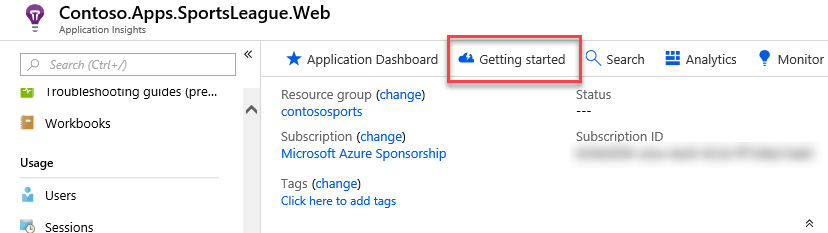

5. In the portal, navigate to **How-to Guides** -> **Application Insights** -> **Code-based monitoring** -> **Web pages** -> **Client-side JavaScript**, then navigate to the **Snippet based setup** section under **Adding the JavaScript SDK** within the documentation page.

    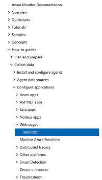

    > **Note**: You can find the documentation page at the following URL: <https://docs.microsoft.com/azure/azure-monitor/app/javascript#snippet-based-setup>

6. Select and copy the full contents of the JavaScript under the **Snippet based setup** heading.

    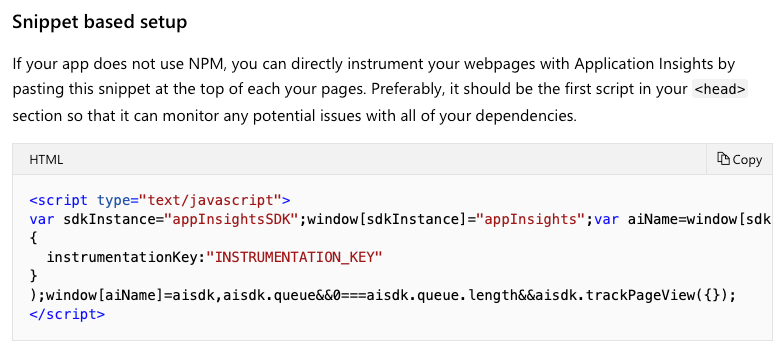

    Here's the JavaScript code to copy/paste for quick reference:

    ```javascript
        <script type="text/javascript">
        var sdkInstance="appInsightsSDK";window[sdkInstance]="appInsights";var aiName=window[sdkInstance],aisdk=window[aiName]||function(e){function n(e){t[e]=function(){var n=arguments;t.queue.push(function(){t[e].apply(t,n)})}}var t={config:e};t.initialize=!0;var i=document,a=window;setTimeout(function(){var n=i.createElement("script");n.src=e.url||"https://az416426.vo.msecnd.net/scripts/b/ai.2.min.js",i.getElementsByTagName("script")[0].parentNode.appendChild(n)});try{t.cookie=i.cookie}catch(e){}t.queue=[],t.version=2;for(var r=["Event","PageView","Exception","Trace","DependencyData","Metric","PageViewPerformance"];r.length;)n("track"+r.pop());n("startTrackPage"),n("stopTrackPage");var s="Track"+r[0];if(n("start"+s),n("stop"+s),n("addTelemetryInitializer"),n("setAuthenticatedUserContext"),n("clearAuthenticatedUserContext"),n("flush"),t.SeverityLevel={Verbose:0,Information:1,Warning:2,Error:3,Critical:4},!(!0===e.disableExceptionTracking||e.extensionConfig&&e.extensionConfig.ApplicationInsightsAnalytics&&!0===e.extensionConfig.ApplicationInsightsAnalytics.disableExceptionTracking)){n("_"+(r="onerror"));var o=a[r];a[r]=function(e,n,i,a,s){var c=o&&o(e,n,i,a,s);return!0!==c&&t["_"+r]({message:e,url:n,lineNumber:i,columnNumber:a,error:s}),c},e.autoExceptionInstrumented=!0}return t}(
        {
          instrumentationKey:"INSTRUMENTATION_KEY"
        }
        );window[aiName]=aisdk,aisdk.queue&&0===aisdk.queue.length&&aisdk.trackPageView({});
        </script>
    ```

7. Navigate to the **Contoso.Apps.SportsLeague.Web** project located in the **Web** folder using the **Solution Explorer** in Visual Studio.

8. Open **Views \> Shared \> \_Layout.cshtml**.

    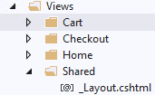

9. Paste in the code before the `</head>` tag. Insert your **Instrumentation Key** from Notepad into the JavaScript code ``instrumentationKey:`` value.

    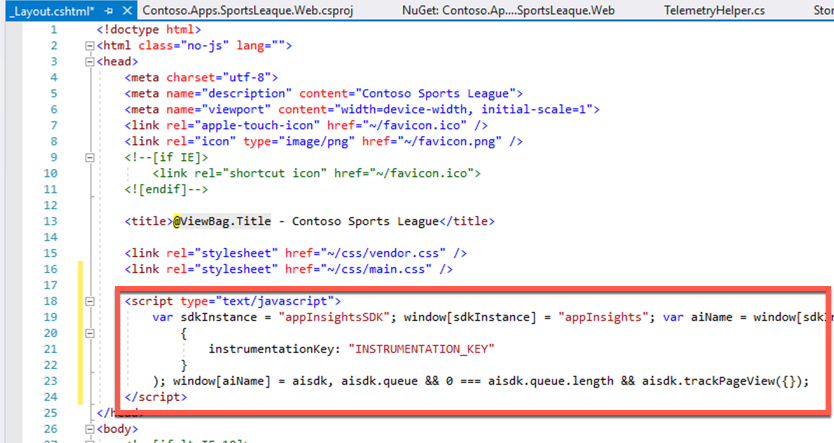

10. Save the **\_Layout.cshtml** file.

#### Subtask 3: Deploy the e-commerce Web App from Visual Studio

1. Navigate to the **Contoso.Apps.SportsLeague.Web** project located in the **Web** folder using the **Solution Explorer** in Visual Studio.

2. Right-click on the **Contoso.Apps.SportsLeague.Web** project, and select **Publish**.

    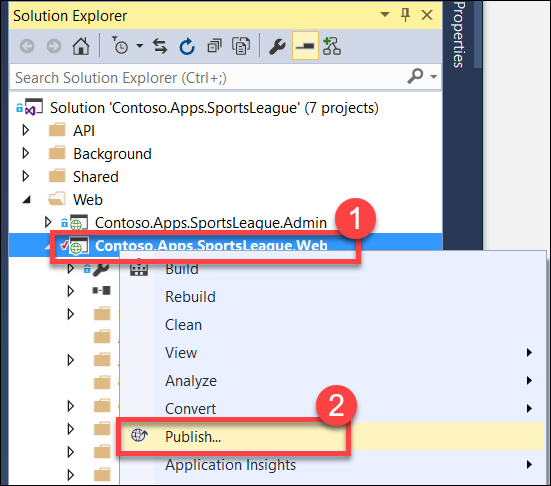

3. Select **Publish** again when the Publish dialog appears.

    Launch a browser **outside of Visual Studio** for testing if the page is loaded in Visual Studio.

4. Select a few links on the published E-Commerce website, and submit several orders to generate some sample telemetry.

### Task 2: Creating the web performance test and load test

#### Subtask 1: Create the load test

1. Open the Azure Management Portal (<http://portal.azure.com>), and navigate to the **contososports** Resource Group.

2. Select the **Application Insights** instance with the name that starts with **contososportsai** that is associated with the Contoso E-Commerce Site.

3. Select **Performance Testing**.

    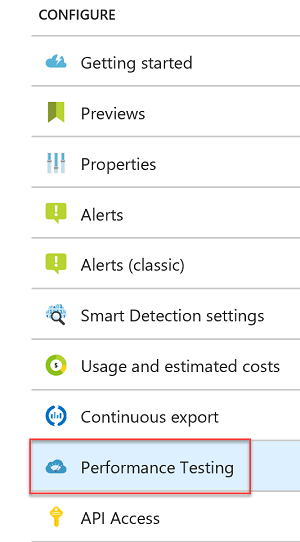

4. Select the **Set Organization** button to associate/create an Azure DevOps account.

    

5. On the Organization Settings tile, select the **Or Create New** link.

    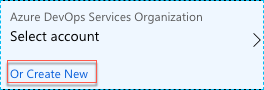

6. Specify a unique name for the account and select a region.

    >**Note**: The region may differ from the region you have deployed your resources.

    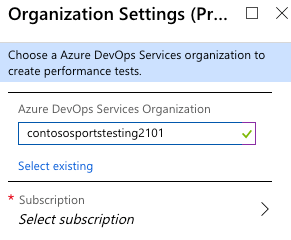

7. Select **Subscription**, and select **your Subscription**.

    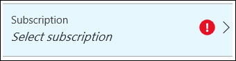

8. Choose **Select location**. Next, select a Location.

    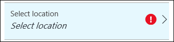

    >**Note**: The location tile may disappear after setting your Subscription.

9. Then, select **OK**.

    >**Note**: The Azure DevOps account creation will take a minute to complete.

10. Select **New**.

    

11. Select **Configure Test Using**.

    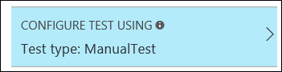

12. Specify the **URL** to the Contoso E-Commerce site, and select **Done**.

    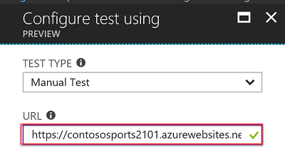

13. Name the test **ContosoSportsTest**, and select the **Run test** button.

    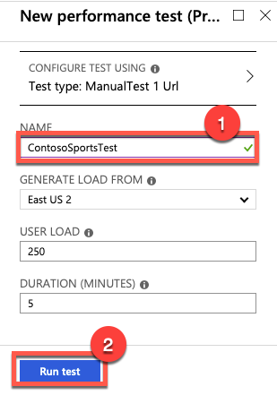

14. Wait until the load test has completed. This may take 5-10 minutes.

    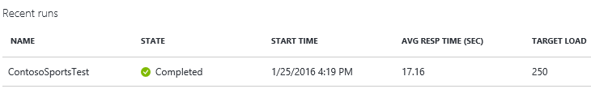

#### Subtask 2: View the Application Insights logs

1. Using a new tab or instance of your browser, navigate to the Azure Management portal <http://portal.azure.com>.

2. On the left menu area, select **All services**.

3. On the **All Services** blade, filter for **Application Insights** and choose the appropriate result.

4. On the **Application Insights** blade, select the Application Insights configuration you created for the e-commerce website.

    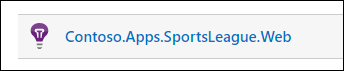

5. Select **Dashboard**.  View the performance timeline to see the overall number of requests and page load time.

    

    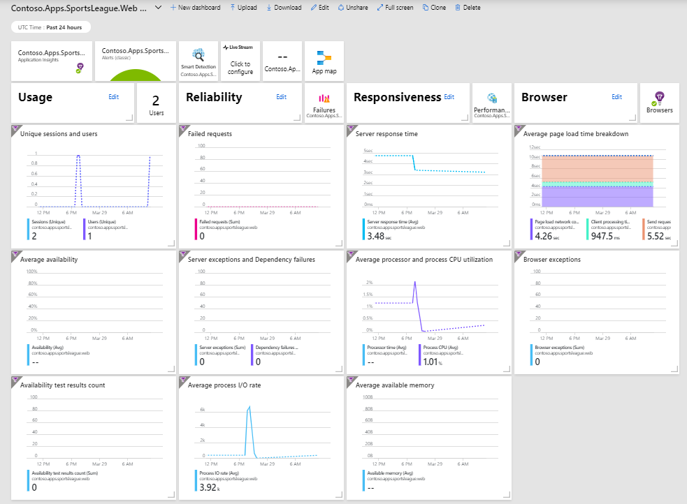

6. Navigate back to the Application Insights overview for ``Contoso.Apps.SportsLeague.Web``. Select **Performance** to see individual endpoint render performance.
  
    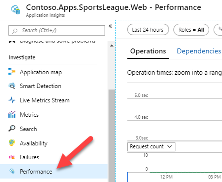

    

7. Under **Usage** link area. select the **Events** menu option. Select the **View More Insights** button.

    

8. Select **View More Metrics**, then scroll down to see event list.

    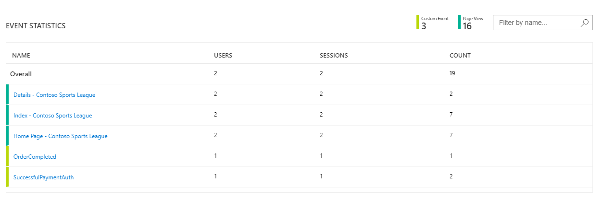

